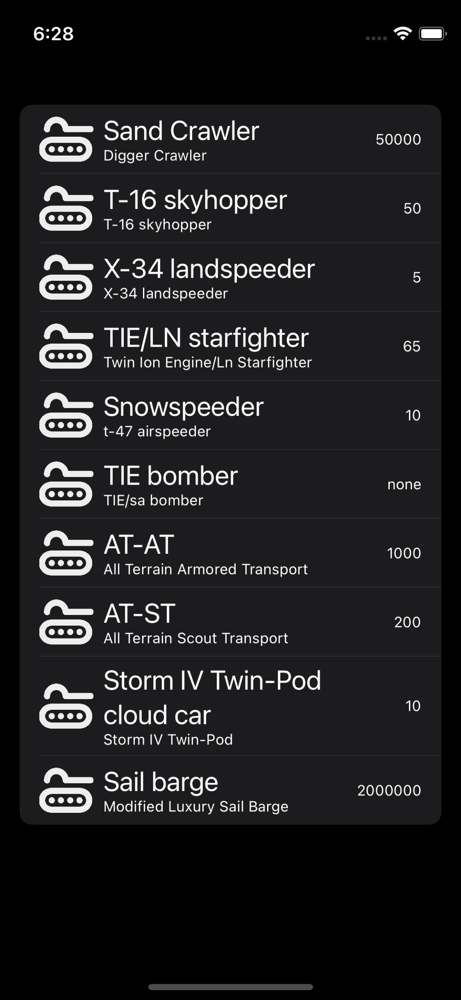

# ios-uikit-programming-challenge
Starter Project for the iOS Programming Challenge in UIKit for candidates unfamiliar with SwiftUI

> This exercise must be performed in **Swift**. 
> 
> Third party libraries may be used, but must be consumed using any Package Manager (Swift Package Manager Preffered)

## Candidate Requirements
* The candidate must arrive to the interview with a machine setup running the latest Xcode version from the App Store.
* The candidate will have 90 minutes to perform the requirements below in a live programming setting

## App Requirements
Create an application that displays a list of Vehicles and Starships in a single list.  This application will be used by members of the Dark side and Jedi forces to lookup suitable vehicles for upcoming battles. 

* The sample app talks about Star Wars
* App data can be fetched from the Star Wars API https://swapi.dev/documentation  
* Within the list, display the name of the Starship or Vehicle by Cargo Capacity in descending order.
* Update the UI to distinguish Starship from a Vehicle
    * Hint: Assets are already loaded on to the sample project for Vehical type and Starship type
* Do not load any UI until Vehicle and Starship data have been fetched from the API
* Add a loading spinner that indicates the data is loading

## What we are looking for
Since this is a live coding assignment, we are not only looking at app completion and requirements being satisfied. We want the candidate to pair with us and walk us through their decision making as they are making their decisions. 

We also setup the starter codebase to be flawed, walk us through improvements and feel encouraged to refactor the code the way you want to do it.

Inform us how we could make our code more testable.

Breif expectations:
* Architecture
* Testability
* Optimization and Reusability

## Starting Point

Finish the skeleton application provided here. Choose the right architecture for the application, and make us part in your decisions. 

The starter project currently functions to display a list of Vehicle objects only.  See screenshot below:

